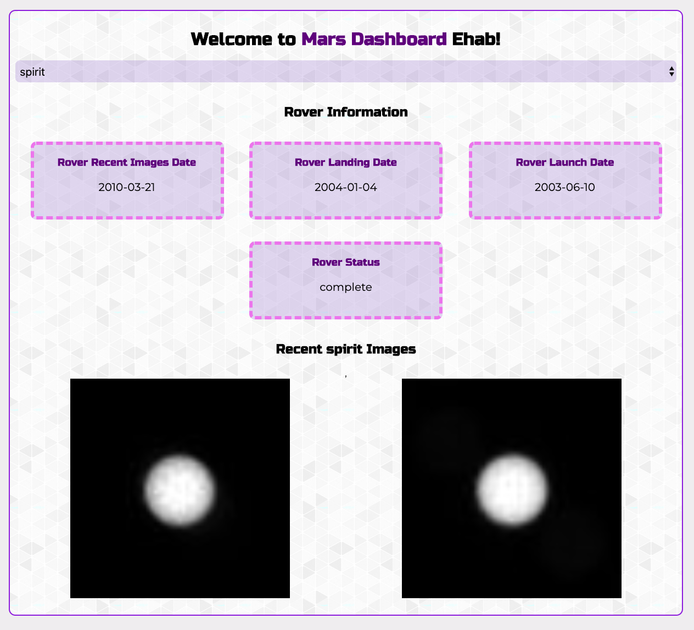

# Functional Programming with Javascript 
## Project setup instructions:
1. Run `npm install` in the root director of the project.
2. Make sure to create a `.env` file and add your Nasa API key to it: `API_KEY=YOUR_API_KEY`.
3. You can either start the project by running one of the following commands:
    * `npx gulp dev`
    * `npm start`

